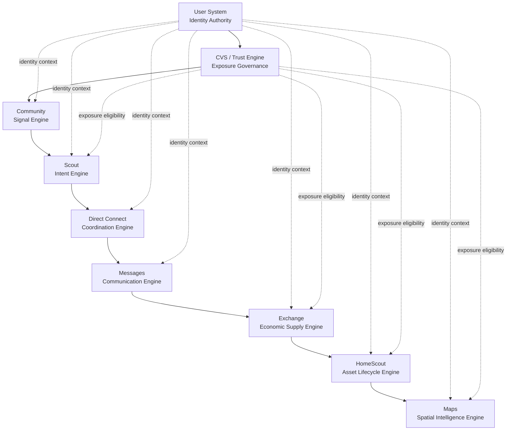

# TradeScout OS Architecture

This document is the canonical onboarding map for the complete TradeScout operating system.

## OS Invariants

TradeScout operates under these non-negotiable invariants:
- Awareness does not grant authority.
- Identity authority precedes trust, routing, and interaction.
- Scout is the bridge from discovery to action.
- Contact remains gated through governed coordination and communication paths.
- Trust (CVS) governs exposure across all engines.
- Engines provide bounded authority and do not bypass each other.

## Engine Diagram

## Engine Responsibilities

Identity
- User System: Governs identity, claims, entity types, permissions, and account state.

Trust
- CVS / Trust Engine: Governs trust eligibility, exposure constraints, and risk outcomes.

Signals
- Community: Produces local proof and behavioral signals for trust input.

Intent
- Scout: Interprets user intent and routes action to governed engines.

Coordination
- Direct Connect: Governs contact authorization and coordination lifecycle.

Communication
- Messages: Governs post-approval transactional communication.

Economy
- Exchange: Governs supply objects, listing lifecycle, and economic discovery.

Asset Lifecycle
- HomeScout: Governs property records, ownership/stewardship context, and lifecycle history.

Spatial Intelligence
- Maps: Governs geographic indexing and location-based discovery routing.

## Engine List

Identity Authority
- User System

Trust Kernel
- CVS / Trust Engine

Signal Layer
- Community

Intent Routing
- Scout

Coordination Authority
- Direct Connect

Communication Layer
- Messages

Economic Engine
- Exchange

Asset Lifecycle
- HomeScout

Spatial Intelligence
- Maps

## Interaction Rules

All engine interactions must follow these rules:
- User System establishes identity authority context.
- CVS gates exposure before engine-level discovery surfaces objects.
- Scout routes intent; it does not grant authority by itself.
- Direct Connect governs who may initiate contact.
- Messages operates only within approved participant and thread boundaries.
- Exchange and HomeScout own their domain objects and lifecycle rules.
- Maps displays governed spatial objects and routes users back to source engines.
- No engine may bypass another engine's explicit authority boundary.

## Engine Interaction Flow

The canonical engine interaction flow is:

User System
-> CVS / Trust Engine
-> Community
-> Scout
-> Direct Connect
-> Messages
-> Exchange
-> HomeScout
-> Maps

Feature implementation must map to this flow and to one or more existing engines.

No new engines should be introduced unless explicitly approved through governance escalation.

## Governance Rules

Platform governance requires:
- Every feature maps to existing governed engines.
- No feature may bypass identity authority, trust eligibility, or contact gating.
- Engine boundaries must remain explicit and auditable.
- Capability grants and exposure outcomes must be deterministic and explainable.
- Contract updates and implementation anchors must be updated together when semantics change.

## Architecture Status

TradeScout OS is fully formalized with nine governed engines:
- User System
- CVS / Trust Engine
- Community
- Scout
- Direct Connect
- Messages
- Exchange
- HomeScout
- Maps

Authority hardening state:
- Phase 1 complete and runtime-proven.
- Phase 2A complete and runtime-proven.
- Phase 2B complete and integration-proven.
- Phase 2C privileged-path slice complete and integration-proven.

Highest-value remaining risks:
- Remaining dedicated admin/support router parity on the shared privileged contract.
- Dedicated token impersonation router parity + proof continuity.
- Audit payload shape continuity across all privileged mutation handlers.

Next enforcement pass:
- Complete Phase 2C across all remaining privileged routers.

This is the complete platform architecture.
