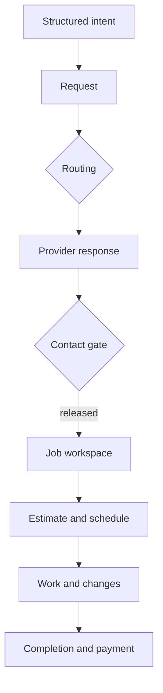

# Phase 1 Product Architecture Blueprint

Date: 2026-07-13

Status: implementation-backed target architecture

Companion implementation record:
`docs/audits/PHASE_1_PRODUCT_ARCHITECTURE_IMPLEMENTATION_2026-07-13.md`

## Executive decision

TradeScout is one coordination product with two primary controllers:

- **Direct Connect** owns requests, provider discovery, controlled contact, assignments, and the
  job lifecycle.
- **Scout** helps a person decide what to do and hands structured intent into the owned product
  surface.

Community, Exchange, Home/Assets, Commercial, and public profiles are context producers and
discovery surfaces. They may start or enrich a Direct Connect request, but they do not create
parallel request, contact, messaging, notification, or reputation systems.

The live navigation is the authority. `AppShell.tsx` owns the narrow primary navigation; unused
navigation rewrites are not evidence of current information architecture. Compatibility URLs are
retained through the typed redirect registry, not presented as additional products.

## 1. Route and audience decisions

| Route family | Primary audience | Product job | Target disposition |
| --- | --- | --- | --- |
| Landing and auth | Visitor, new user | Explain the system and establish identity | Keep outside persistent product navigation |
| Direct Connect | Requester, provider, worker | Create, route, respond, coordinate, and complete work | Canonical coordination workspace |
| Scout | Any user | Understand intent and recommend the next owned action | Canonical decision controller |
| Community | Resident, business, moderator | Local context and public participation | Keep one routed feed and one post representation |
| Exchange | Buyer, seller | Local goods and listing discovery | Keep as a bounded commerce context; hand coordination to canonical inbox/contact gates |
| Home and assets | Homeowner, asset owner | Maintain property/asset records | Keep as a context producer for Scout and Direct Connect |
| Business operations | Business owner, provider | Finance, CRM, promotions, and fulfillment tools | Keep behind contextual business entry, not top-level route proliferation |
| Public profiles and directory | Visitor, requester, provider | Discover and evaluate a person or business | Keep public; use canonical provider presentation and gated contact CTA |
| Trade/geographic SEO | Search visitor | Discover local information and providers | Keep public and separate from in-app navigation semantics |
| Partner campaigns | External campaign visitor | Partner-specific acquisition | Keep isolated from AppShell when the campaign owns the viewport |
| Admin | Authorized platform staff | Operations, verification, moderation, and support | Keep inside AdminShell; retire internal legacy labels incrementally |
| Legacy aliases | Existing links and bookmarks | Compatibility only | Registry-owned redirects; never add to navigation |

### Audience model

Product behavior should derive from capabilities and context, not a unique dashboard for every
role. The durable audience groups are:

| Audience | Capabilities that matter |
| --- | --- |
| Requester | Create request, choose routing, approve contact, accept work, manage lifecycle |
| Provider/business | Receive or discover requests, respond, request contact, estimate, fulfill |
| Worker/helper | Receive eligible open-category work, respond, fulfill assigned work |
| Community participant | Read globally where allowed; act locally where authorized |
| Buyer/seller | Discover and transact within Exchange context |
| External recipient | Open a token-scoped share or procurement response without platform navigation |
| Staff/admin | Operate governed tools according to explicit administrative capabilities |

Role-specific dashboards remain only where they own a distinct operational job. A dashboard whose
only useful action is “go to Direct Connect” should redirect or become a contextual entry, not a
second home.

## 2. Canonical object architecture

| Product object | Canonical system | Canonical presentation | Competing systems | Decision |
| --- | --- | --- | --- | --- |
| Person/account | `users` plus role/identity metadata | Account/profile primitives | `userProfiles` naming overlaps public `profiles` | Keep data boundaries; reserve “Profile” in UI for public identity |
| Business/provider | `businesses` with normalized provider view model | `ProviderCard` and canonical public detail | Legacy contractor cards and hand-built directory cards | Converge presentation first; preserve compatibility data until measured |
| Public profile | `profiles` content blocks | `ProfileSiteView` and intentional branded theme | No equivalent canonical detail competitor | Keep |
| Direct Connect request | `workRequests` plus events | `DirectConnectRequestCard` and request detail/workspace | Inline task, Scout, Community, and shell renderings | Canonical card/detail with density variants |
| Response/assignment | `workRequestAssignments` | Request detail response state | Task applications and employment applications | Keep current systems; converge only after lifecycle and telemetry proof |
| Community post | `communityPosts` stack | `CommunityPostCard` | `socialPosts` plus `PostCard`/`SocialFeed` | Keep Community; quarantine social stack |
| Conversation | `conversations`/`messages` for general and Direct Connect | Unified `/messages` workspace with context adapter | Marketplace and procurement message stores | Unify presentation now; defer storage convergence |
| Notification | Generic `notifications` | AppShell Notification Center | Direct Connect internal notification endpoints/events | Generic UI owner; retain internal paths as compatibility/audit until measured |
| Employment opportunity | `employmentPosts` and applications | Employment Board bridged into Direct Connect intent | Work requests with employment/open categories | Preserve both directions; do not merge without status and history mapping |
| Job workspace | Direct Connect job/lifecycle records | Request detail lifecycle panels | Employment-only status and procurement workspaces | Keep bounded contexts; share primitives where semantics match |
| Saved item | Object-specific save/favorite tables | Contextual saved views | Six object-specific stores | Defer polymorphic convergence; low Phase 1 value |
| Money record | Estimate, invoice, payment, receipt, procurement authorization records | Lifecycle finance panels | Several legacy payment/quote paths | Last migration class; reconciliation and retention required |

### Presentation rule

One object may have multiple densities, never multiple meanings:

- `compact`: embedded context in Scout, Community, or inbox.
- `standard`: board/search result.
- `detail`: full object, decisions, history, and authorized actions.
- `ops`: administrative density with operational metadata.

Every density consumes the same normalized view model and trust vocabulary. Contact fields are not
part of the base request/provider presentation and appear only after the contact gate releases
them.

## 3. Direct Connect capability map

| Capability | Current owner | Architecture decision |
| --- | --- | --- |
| Initiate | Direct Connect entry parser and composer | Accept structured context from profiles, Community, Exchange, Home, employment, and Scout |
| Receive | Contractor, business, and eligible worker candidate routing | Normalize to “provider” in UI while preserving eligibility-specific data |
| Categories | Request type plus typed intent | Intent is the user-facing choice; request type is routing/lifecycle metadata |
| Routing | Top-count automatic routing or direct provider selection | Keep both modes and county-scoped candidate eligibility |
| Open board | County/service-area board plus express interest | Keep self-selection separate from targeted dispatch |
| Response | Interest/information/not-fit/unavailable plus assignment accept/decline | Present as one response timeline; do not erase distinct legal states |
| Contact | Provider request, requester approve/deny, release | `DecisionContactGatePanel` remains the canonical state machine |
| Messaging | Unified inbox after authorized thread creation | Preserve context adapters and one mark-read path |
| Workspace | Created at contact release | Keep lifecycle creation lazy; no premature job workspace |
| Lifecycle | Estimate, schedule, work, checkpoints, changes, punch list, completion, invoice, payment | Keep as Direct Connect’s canonical fulfillment path |
| Employment | Separate bidirectional job/resume board with typed Direct Connect handoff | Bridge presentation and intent now; storage merge is gated |
| Trust | Eligibility gates, verification, recommendations, completed/relevant work | No stars, public composite score, or synthetic confidence percentage |
| Notifications | Generic notification service and AppShell center | No second Direct Connect notification center |
| Share | Token-scoped read-only request view | Keep as an external-recipient boundary |

### Lifecycle topology

Contact visibility is an authorization result, not a card field. The request can be visible on a
board without exposing requester contact data. The job workspace begins only after contact is
released.

## 4. Visual and interaction architecture

| Area | Decision | Enforcement/status |
| --- | --- | --- |
| Surface ownership | AppSurface/AppShell/AppFrame own viewport, canvas, and scroll | AppShell page roots no longer use `min-h-screen`; recursive contract active |
| Navigation | AppShell is the only global navigation owner | Dead navigation rewrites are quarantined, not treated as target IA |
| Cards | Shared primitive plus canonical object cards and density variants | Request, provider, and Community post owners established |
| Overlays | Shared dialog/drawer primitives unless a bounded interaction requires otherwise | Migrate bespoke overlays when touched |
| Color | Semantic surface/text/border/accent tokens | Do not perform blind global replacement of white/black alpha utilities; replace by semantic role when touching a surface |
| Trust | Evidence and qualitative states | Customer-facing star/rating and composite-score presentation removed and guarded |
| Terminology | Product language, not internal routing jargon | Existing contracts reject customer-facing chatbot/score leakage |
| Operational headers | Task title, status, next action; no marketing hero | Direct Connect mobile contract enforces operational composition |

The large count of `text-white`/`bg-white` utilities is design-token debt, not a safe mechanical
codemod. Alpha whites often encode border or elevation roles. Migration must map each use to
`text-primary`, `text-secondary`, `border-subtle`, `surface-card`, or another semantic token and
verify contrast.

## 5. Canonical terminology

| Avoid in customer UI | Canonical term | Notes |
| --- | --- | --- |
| Lead | Request or opportunity | “Lead” may remain in historical/internal schema names until migration |
| Contractor (generic) | Provider or business | Use contractor only when licensing/trade semantics specifically require it |
| Homeowner (generic requester) | Requester or customer | Use homeowner only for home-specific eligibility or copy |
| Match score / routing score | Why this fits | Show evidence: location, service, availability, verification, relevant work |
| CVS value | Trust evidence | Internal composite may inform policy, never become a public reputation number |
| Star rating / highest rated | Recommendations, verified work, relevant experience | Explicit transaction feedback can remain qualitative |
| AI assistant / chatbot | Scout | Scout is the product name and decision controller |
| Auto-route | Send to top local providers | Internal dispatch mode may remain in code |
| Direct pick | Choose providers | User-facing action language |
| Contact unlock | Contact release | Release occurs only after the governed decision state |
| Contractor console | Provider workspace | Preserve legacy endpoint naming until a safe API migration |
| Job workspace (early flow) | Request detail | Call it a job only after contact release/assignment semantics exist |
| Social feed | Community | Community is the canonical product surface |
| Marketplace (generic product) | Exchange | Marketplace may remain in context adapter/schema names |

## 6. Disposition table

| Surface/system | Disposition | Timing | Exit condition |
| --- | --- | --- | --- |
| Direct Connect request, card, and lifecycle | Keep and strengthen | Now | Canonical contracts remain green |
| Provider presentation | Rebuild/converge | Phase 1–2 | All active discovery contexts use normalized provider view |
| Community post stack | Keep | Now | One routed feed and card owner |
| `socialPosts`/`SocialFeed` | Quarantine | Now | 30-day zero-reader/writer proof before migration proposal |
| Unified inbox presentation | Keep | Now | Context and unread parity across active stores |
| Message table convergence | Defer | Later | Authority, attachment, export, socket, unread, and order audits complete |
| Generic notification UI | Keep | Now | All customer notification actions use the global owner |
| Direct Connect notification endpoints | Quarantine | Phase 2 | Consumer telemetry and generic parity established |
| Employment Board | Keep and bridge | Now | Bidirectional job/resume behavior preserved |
| Employment/work-request storage merge | Defer | Later | Status/history/contact/lifecycle transform proven |
| Dead navigation rewrites | Retire after importer/build proof | Phase 2 | No runtime/dynamic importer and clean build |
| Legacy redirect pages | Replace with registry entries | Ongoing | Every static alias has one registry owner |
| Role-dashboard stubs | Redirect or retire | Ongoing | No unique job or active contextual entry remains |
| Money-bearing records | Keep | Now | Reconciliation, idempotency, retention, and rollback evidence |
| Object-specific favorites | Keep | Later | Polymorphic design proves permissions and deletion semantics |

## 7. Migration sequence

1. **Lock ownership in presentation.** Maintain canonical request, provider, Community post,
   inbox, notification, redirect, trust, and surface contracts.
2. **Instrument quarantined systems.** Add 30-day read/write counters by endpoint and background
   job, row/relation counts, and owner dashboards for `socialPosts` and Direct Connect notification
   compatibility paths.
3. **Converge read models.** Build adapters that produce canonical view models while source stores
   remain unchanged. Compare counts, ordering, authority, and action parity.
4. **Propose one bounded migration at a time.** Attach deterministic transform, checksums, orphan
   report, privacy/retention review, dual-read/write window, alert threshold, and rollback.
5. **Run reversible dual operation.** Keep original writers and routes available until exact
   reconciliation passes for the agreed release window.
6. **Remove dead UI and compatibility code.** Only after production telemetry shows no consumer;
   preserve URL redirects where external links may persist.
7. **Migrate messaging and employment only after their semantic audits.** Do not force contexts
   with different authority or lifecycle rules into one table merely because their cards look
   similar.
8. **Migrate money last.** Estimates, invoices, payments, receipts, disputes, and procurement
   authorizations require ledger-grade reconciliation and legal retention proof.

No destructive schema operation belongs to Phase 1. Static code similarity is evidence for an
investigation, not authorization to merge or drop data.

## 8. Representative screen specifications

### Direct Connect — Start

- Header: “What do you need to coordinate?” with county context and no marketing hero.
- Primary intent choices: fix/improve, vehicle, find a person/business, sell/list, property,
  offer services, employment, browse.
- Context receipt: show the source business, post, deal, home, profile, or employment item when
  supplied; allow removal without silently discarding it.
- Composer: ask only questions required for the selected intent and routing decision.
- Primary action: “Review routing”; secondary action: save/exit.

### Direct Connect — Board / Opportunities

- Standard `DirectConnectRequestCard` rows/cards with title, category, county, timing, budget when
  provided, safe request summary, and qualitative eligibility evidence.
- No requester contact fields before release.
- Provider actions: express interest, ask for information, unavailable/not a fit.
- Filters: county/service area, intent/category, timing, status; filters do not change authority.

### Direct Connect — Request detail

- Top: canonical status, next decision, and safe request facts.
- Decision area: routing choice or provider response according to viewer role.
- Contact area: canonical gate state and exactly one allowed next action.
- Timeline: request events, responses, approvals, and assignment state.
- After release: job workspace panels for estimate, schedule, work, change, completion, invoice,
  and payment; deep links reopen the exact relevant panel.

### Provider discovery / public profile

- `ProviderCard` standard density: business identity, service coverage, verification evidence,
  recommendations/relevant work, and availability where real.
- Primary action: start Direct Connect with provider identity preserved.
- Secondary action: view profile.
- No star rating, highest-rated claim, CVS number, or synthetic confidence percentage.

### Unified inbox

- Thread list: participant, last message, unread state, and context label (Direct Connect,
  Community, Exchange, Support, procurement).
- Conversation: message chronology plus one contextual object summary.
- Direct Connect thread: job-assist card links to exact request/workspace action.
- Procurement context remains read-only where its authority requires it.
- One authorized mark-read path; changing context never changes thread identity.

### Community feed

- One `CommunityPostCard` owns content, media, topics, comments, reactions, saves, share,
  moderation, and related business/request context.
- Global reading may coexist with county-scoped actions; the UI explains the action gate.
- “Send to Direct Connect” creates structured entry context, not a parallel community request.

## 9. Acceptance gates

The target is considered preserved when:

1. Active routes have one declared audience, job, access posture, and canonical owner.
2. Compatibility aliases exist only in the typed registry or explicit dynamic/hard redirects.
3. Request/provider/post presentations use canonical components or declared density adapters.
4. Customer-facing trust decisions contain evidence, never public numeric reputation shortcuts.
5. Contact remains absent until the canonical gate releases it.
6. AppShell remains the sole global navigation, viewport, canvas, and scroll owner.
7. Employment, messaging, notification, and money data are not destructively converged without
   the deep-schema gate evidence.
8. Production deployment is verified by exact `x-tradescout-build` SHA and representative route
   smoke tests.

## 10. Explicitly unresolved

- Production reader/writer telemetry for quarantined tables and endpoints.
- Deterministic transforms, checksums, orphan reports, and rollback rehearsals for schema work.
- Generic lifecycle vocabulary for business/worker providers in legacy requester/contractor
  service types.
- Retirement proof for unused navigation implementations and other quarantined UI.
- Semantic token migration for remaining non-semantic color utilities, performed surface by
  surface with contrast verification.

These are tracked prerequisites, not permission to guess. Phase 1 closes the ownership and
presentation architecture while leaving irreversible data changes behind explicit evidence gates.
